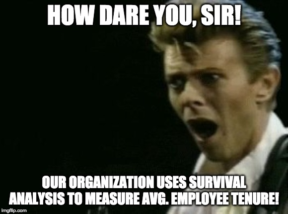

```{r setup, echo=FALSE, message=FALSE, warning=FALSE}
library(boot)
library(DiagrammeR)
library(DT)
library(dplyr)
library(emo)
library(ggplot2)
library(knitr)
library(lubridate)
library(scales)
library(survival)
library(widgetframe)

knitr::opts_chunk$set(dpi=300, fig.height=6, out.width="100%")
```

name: disclaimer
class: middle, inverse

### Everything I say today is my own personal opinion

--

### I don't speak for Amazon

--

### But .amazon-orange[Flex Driver Science Team] is the bee's knees. You could join us!


```{r echo=FALSE, fig.height=0.1, message=FALSE, warning=FALSE}
knitr::include_graphics("./beeknee.jpg")
```

---

name: ice-breaker
class: middle

# Raise your hand if your organization uses...

--

- .orange[**avg. time to fill job reqs**] to gauge .teal[**recruiting performance**]

--

- .orange[**avg. time to promotion**] to gauge .teal[**upward mobility**]

--

- .orange[**avg. time to termination**] to gauge .teal[**employee retention**]

---

name: stoking-controversy
class: middle

# Now let's stoke some .controversy[controversy]

---

name: first-controversial-statement
class: middle, inverse

# Many organizations calculate<br>these metrics incorrectly

---

name: second-controversial-statement
class: inverse, center, middle

## Not .controversy[controversial] enough for you?

--


--

### (except avg. employee tenure... sometimes)

---

name: before-we-poop
class: middle, inverse

# `r emo::ji("poop")` But before we poop all over cherished people metrics... `r emo::ji("poop")`

--

C'mon, Hanowell! These metrics are:

- .teal[**Easy**] to understand
- .teal[**Easy**] to calculate
- It's .orange[**what people actually want to know**]

---

name: should-we-do-easy-stuff
class: middle, center

# .teal[**Easy**] to understand

--

# .teal[**Easy**] to calculate

--

## `r emo::ji("thinking")` Should we do stuff just because it's easy? `r emo::ji("thinking")`

---

name: what-people-wanna-know
class: middle, center

# It's .orange[**what people actually want to know**]

--

# `r emo::ji("thinking")` Is it? `r emo::ji("thinking")`

---

name: agenda
class: middle

- What's the matter with avg. time to (whatever)?

--

- Suggest a better way:

--

# .center[`r emo::ji("hooray")` .hero-shot[EVENT<br>HISTORY<br>ANALYSIS] `r emo::ji("hooray")`]

--

.right[Survival analysis]
.right[Competing risks]
.right[Cure models]
.right[Repeated event models]
.right[Multi-state models]

---

name: whats-the-matter-with-whatever

### What's the matter with avg. time to (whatever)?

---

name: whats-the-matter-with-avg-time-to-fill

### What's the matter with .orange[**avg. time to fill a job requisition**]?

---

template: whats-the-matter-with-avg-time-to-fill

### For now, assume this metric .controversy[isn't utterly meaningless].

---

template: whats-the-matter-with-avg-time-to-fill

### .orange[**The problem**] is when you calculate it .teal[**using only filled job requisitions**]

---

name: toy-example
template: whats-the-matter-with-avg-time-to-fill

### Toy example

---

template: toy-example

- Suppose it's back at the end of 2018
- We had three job requisitions open at any point that year:

```{r echo=FALSE, message=FALSE, warning=FALSE}
end2017 <- as.Date("2017-12-31")
end2018 <- as.Date("2018-12-31")
toyexample <- tibble::tribble(
  ~`Requisition ID`,    ~`Date opened`,          ~`Time to fill (months)`,
  1,                    as.Date("2018-06-01"),   3,
  2,                    as.Date("2018-03-01"),   1,
  3,                    as.Date("2017-10-01"),   NA
) %>%
  dplyr::mutate(
    `Date filled` = `Date opened` + months(`Time to fill (months)`),
    `Requisition months` = coalesce(
      `Time to fill (months)`,
      lubridate::interval(`Date opened`, end2018) %/% months(1)
    ),
    `Requisition months (2018)` = if_else(
      `Date opened` > end2017,
      `Time to fill (months)`,
      `Requisition months`
      - lubridate::interval(`Date opened`, end2017) %/% months(1)
    )
  ) %>%
  dplyr::select(`Requisition ID`,
                `Date opened`,
                `Date filled`,
                everything())
ignoring_censoring <- toyexample %>%
  dplyr::select(-`Requisition months`,
                -`Requisition months (2018)`)
ignoring_censoring %>%
  DT::datatable(rownames = FALSE, options = list(dom = 't'))
```

---

template: toy-example

- Let's throw out the un-filled req cuz we don't know it's fill time, right?

```{r echo=FALSE, message=FALSE, warning=FALSE}
onlyfilled <- ignoring_censoring %>%
  dplyr::filter(!is.na(`Time to fill (months)`))
onlyfilled %>%
  DT::datatable(rownames = FALSE, options = list(dom = 't'))
```

--

- The .orange[**avg. time to fill**] is then just `r mean(onlyfilled[[4]])` months.

--

- The .orange[**monthly fill rate in 2018**], assuming it was constant (.controversy[LOL]): $\frac{1}{`r mean(onlyfilled[[4]])`}$<br>
(half a req filled for every month a req is open)

--

- The .orange[**annual fill rate**] is the monthly fill rate $\times$ 12 months:<br> $\frac{1}{`r mean(onlyfilled[[4]])`} \times 12 = `r 12/mean(onlyfilled[[4]])`$ reqs filled for every year a req is open

--

# .center[.hero-shot[AWESOME]]

---

name: wait-a-second
class: inverse, middle, center


---

template: toy-example

Aren't we forgetting someone?

```{r echo=FALSE, message=FALSE, warning=FALSE}
withoutdates <- toyexample %>%
  dplyr::select(-`Date opened`,
                -`Date filled`)
withoutdates %>%
  DT::datatable(rownames = FALSE, options = list(dom = 't'))
```

--

The **actual** monthly fill rate is:<br>
.center[$$\frac{\text{number of reqs filled in 2018}}{\text{total number of months requisitions were open during 2018}}$$]

--

Which is $\frac{2}{`r paste(withoutdates[[4]], collapse = " + ")`} = \frac{2}{`r sum(withoutdates[[4]])`} = `r 2/sum(withoutdates[[4]])`$

---

name: no-wonder-they-are-pissed
class: inverse, middle, center

.h1[.orange[**avg. time to fill**]] = $\frac{1}{`r 2/sum(withoutdates[[4]])`} \approx$ .h1[.controversy[`r round(sum(withoutdates[[4]])/2, 0)` months]]

--

# NOT `r mean(onlyfilled[[4]])` MONTHS

--

Recruiting takes .controversy[`r round((sum(withoutdates[[4]])/2)/mean(onlyfilled[[4]]), 1)` times longer] than we're telling the hiring managers.

--

# `r emo::ji("thinking")` No wonder they're pissed.

---

name: do-not-do-that

# IN GENERAL

## `if:`

- you .teal[**use only cases where (whatever) happened**]<br>to measure .orange[**avg. time**] to (whatever)

--

## `then:`

- you will .controversy[underestimate] the .orange[**avg. time**] to (whatever)
- you will .controversy[overestimate] the .orange[**rate**] at which (whatever) occurs

--

# .center[.hero-shot[SO DON'T DO THAT.]]

---

name: how-dare-you-sir
class: inverse, middle, center

Analytically-savvy audience members are thinking:



---

name: survival-analysis-example

## Survival analysis example: Employee tenure

---

template: survival-analysis-example

- **Survival curve** $S(t)$: Chance employee stays at company beyond time $t$

--

```{r echo=FALSE, fig.height=4, message=FALSE, warning=FALSE}
data(lung)
survdata <- survival::survfit(Surv(time, status) ~ 1, data = lung)$surv %>%
  tibble::tibble(s_0 = .) %>%
  dplyr::mutate(t = 1:nrow(.),
                s_1 = boot::inv.logit(logit(s_0) + log(1.5)),
                c_0 = 1 - s_0,
                c_1 = 1 - s_1,
                cv_0 = c_0 * 0.4,
                ci_0 = c_0 - cv_0)
ggplot2::ggplot(survdata, aes(x = t, y = s_0)) +
  ggplot2::geom_line() +
  ggplot2::scale_y_continuous(labels = scales::percent_format(accuracy = 1L),
                              lim = c(0,1)) +
  ggplot2::labs(
    title = "Example of a survival curve",
    x = "Months since hire",
    y = "% employees\nremaining",
    caption = "Spoiler: Not actually employee tenure data; lung cancer survival data"
  ) +
  ggplot2::theme_minimal() +
  ggplot2::theme(axis.title.y = element_text(angle = 0))
```

---

template: survival-analysis-example

- .orange[**Avg. tenure**] is the sum of $S(t)$ across time points $t$, that is $\sum_t S(t)$

```{r echo=FALSE, fig.height=4, message=FALSE, warning=FALSE}
ggplot2::ggplot(survdata, aes(x = t, y = s_0)) +
  ggplot2::geom_area(color = "orange", fill = "orange") +
  ggplot2::annotate("text", x = max(survdata$t) * 0.8, y = 0.8,
                    label = paste("Avg. tenure ≈",
                                  round(sum(survdata$s_0), 0),
                                  "months")) +
  ggplot2::scale_y_continuous(labels = scales::percent_format(accuracy = 1L),
                              lim = c(0,1)) +
  ggplot2::labs(
    title = "Avg. tenure is the area under the survival curve",
    x = "Months since hire",
    y = "% employees\nremaining",
    caption = "Spoiler: Not actually employee tenure data; lung cancer survival data"
  ) +
  ggplot2::theme_minimal() +
  ggplot2::theme(axis.title.y = element_text(angle = 0))
```

---

name: cumulative-incidence-function
template: survival-analysis-example

- .teal[**Cumulative incidence function**] $C(t)$: Chance employee leaves by time $t$

---

template: cumulative-incidence-function

```{r echo=FALSE, fig.height=4, message=FALSE, warning=FALSE}
ggplot2::ggplot(survdata, aes(x = t, y = c_0)) +
  ggplot2::geom_line(color = "#008080") +
  ggplot2::annotate("point", color = "#008080",
                    x = 100, y = survdata$c_0[survdata$t == 100]) +
  ggplot2::annotate("text", hjust = -0.1, vjust = 1,
                    x = 100, y = survdata$c_0[survdata$t == 100],
                    label =
                      paste(
                        "About",
                        scales::percent(survdata$c_0[survdata$t == 100],
                                        accuracy = 1L),
                        "chance employee\nleaves after 100 months"
                      )
                    ) +
  ggplot2::scale_y_continuous(labels = scales::percent_format(accuracy = 1L),
                              lim = c(0,1)) +
  ggplot2::labs(
    title = "Cumulative incidence function",
    x = "Months since hire",
    y = "% chance employee\nleft company\nby this time",
    caption = "Spoiler: Not actually employee tenure data; lung cancer survival data"
  ) +
  ggplot2::theme_minimal() +
  ggplot2::theme(axis.title.y = element_text(angle = 0))
```

---

name: cumulative-incidence-segue
class: inverse

# A brief segue on cumulative incidence

- "What's the chance that (whatever) will happen by (some target date)?"

--

    - **Hiring manager:** "Will I fill this role in time to finish this project?"
    
--

    - **Finance:** "Will we meet our target headcount by mid-year?"
    
--

    - **Job candidate:** "What's the chance I'll get promoted within a year?"
    
--

# .center[
  .hero-shot[.orange[It's what people] (actually) .orange[want to know]]
]

---

template: cumulative-incidence-function

```{r echo=FALSE, fig.height=4, message=FALSE, warning=FALSE}
survdata %>%
  dplyr::select(t, c_0, c_1) %>%
  tidyr::gather(key = scenario, value = c, -t) %>%
  ggplot2::ggplot(aes(x = t, y = c, linetype = scenario)) +
  ggplot2::geom_line(color = "#008080") +
  ggplot2::scale_y_continuous(labels = scales::percent_format(accuracy = 1L),
                              lim = c(0,1)) +
  ggplot2::scale_linetype_discrete(name = NULL,
                                   labels = c("If we do nothing",
                                              "If we do X")) +
  ggplot2::labs(
    title = "Comparing two cumulative incidence functions",
    x = "Months since hire",
    y = "% chance employee\nleft company\nby this time",
    caption = "Spoiler: Not actually employee tenure data; lung cancer survival data"
  ) +
  ggplot2::theme_minimal() +
  ggplot2::theme(axis.title.y = element_text(angle = 0),
                 legend.position = "top")
```

---

template: cumulative-incidence-function

```{r echo=FALSE, fig.height=4, message=FALSE, warning=FALSE}
ggplot2::ggplot(survdata, aes(x = t, ymin = c_1, ymax = c_0)) +
  ggplot2::geom_ribbon(fill = "#008080") +
  ggplot2::scale_y_continuous(labels = scales::percent_format(accuracy = 1L),
                              lim = c(0,1)) +
  ggplot2::annotate("text", x = max(survdata$t) * 0.25, y = 0.75,
                    label =
                      paste("We lose about",
                            round(sum(survdata$c_0 - survdata$c_1), 0),
                            "months of tenure\nper employee by not doing X")) +
  ggplot2::labs(
    title = "Comparing two cumulative incidence functions",
    x = "Months since hire",
    y = "% chance employee\nleft company\nby this time",
    caption = "Spoiler: Not actually employee tenure data; lung cancer survival data"
  ) +
  ggplot2::theme_minimal() +
  ggplot2::theme(axis.title.y = element_text(angle = 0))
```


---

name: fun-fact-about-cumulative-incidence
class: inverse

# "Fun" fact about .teal[**cumulative incidence**]

## It's just the opposite of the .orange[**survival function**]! $C(t) = 1 - S(t)$

--

## .center[.controversy[BUT ONLY IF THERE ARE NO COMPETING RISKS]]

---

name: what-are-competing-risks

## What are competing risks?

---

template: what-are-competing-risks

### Voluntary vs. involuntary termination

```{r echo=FALSE, message=FALSE, warning=FALSE}
DiagrammeR::grViz("
  digraph {
  
    graph [layout = dot, rankdir = LR]
    
    # define the global styles of the nodes. We can override these in box if we wish
    node [shape = square, style = filled]
    
    hired [label = 'Hired', fillcolor = Moccasin]
    voluntary [label =  'Voluntary\ntermination', fillcolor = PowderBlue]
    involuntary [label = 'Involuntary\ntermination', fillcolor = SteelBlue]
    
    # edge definitions with the node IDs
    hired -> {voluntary involuntary}
  }
") %>%
  widgetframe::frameWidget(height = 400)
```

---

template: what-are-competing-risks

### Regrettable vs. un-regrettable termination

```{r echo=FALSE, message=FALSE, warning=FALSE}
DiagrammeR::grViz("
  digraph {
  
    graph [layout = dot, rankdir = LR]
    
    # define the global styles of the nodes. We can override these in box if we wish
    node [shape = square, style = filled]
    
    hired [label = 'Hired', fillcolor = Moccasin]
    regrettable [label =  'Regrettable\ntermination', fillcolor = Lavender]
    unregrettable [label = 'Un-regrettable\ntermination', fillcolor = MediumPurple]
    
    # edge definitions with the node IDs
    hired -> {regrettable unregrettable}
  }
") %>%
  widgetframe::frameWidget(height = 400)
```

---

template: what-are-competing-risks

### First promotion vs. termination

```{r echo=FALSE, message=FALSE, warning=FALSE}
DiagrammeR::grViz("
  digraph {
  
    graph [layout = dot, rankdir = LR]
    
    # define the global styles of the nodes. We can override these in box if we wish
    node [shape = square, style = filled]
    
    hired [label = 'Hired', fillcolor = Moccasin]
    promotion [label =  'Promotion', fillcolor = Orange]
    termination [label = 'Termination', fillcolor = PowderBlue]
    
    # edge definitions with the node IDs
    hired -> {promotion termination}
  }
") %>%
  widgetframe::frameWidget(height = 400)
```

---

template: what-are-competing-risks

### First promotion vs. termination

```{r echo=FALSE, message=FALSE, warning=FALSE}
DiagrammeR::grViz("
  digraph {
  
    graph [layout = dot, rankdir = LR]
    
    # define the global styles of the nodes. We can override these in box if we wish
    node [shape = square, style = filled]
    
    hired [label = 'Hired', fillcolor = Moccasin]
    promotion [label =  'Promotion', fillcolor = Orange]
    voluntary [label =  'Voluntary\ntermination', fillcolor = PowderBlue]
    involuntary [label = 'Involuntary\ntermination', fillcolor = SteelBlue]
    
    # edge definitions with the node IDs
    hired -> {promotion voluntary involuntary}
  }
") %>%
  widgetframe::frameWidget(height = 400)
```

---

template: what-are-competing-risks

### First promotion vs. termination

```{r echo=FALSE, message=FALSE, warning=FALSE}
DiagrammeR::grViz("
  digraph {
  
    graph [layout = dot, rankdir = LR]
    
    # define the global styles of the nodes. We can override these in box if we wish
    node [shape = square, style = filled]
    
    hired [label = 'Hired', fillcolor = Moccasin]
    promotion [label =  'Promotion', fillcolor = Orange]
    regrettable [label =  'Regrettable\ntermination', fillcolor = Lavender]
    unregrettable [label = 'Un-regrettable\ntermination', fillcolor = MediumPurple]
    
    # edge definitions with the node IDs
    hired -> {promotion regrettable unregrettable}
  }
") %>%
  widgetframe::frameWidget(height = 400)
```

---

template: what-are-competing-risks

### First promotion vs. termination

```{r echo=FALSE, message=FALSE, warning=FALSE}
DiagrammeR::grViz("
  digraph {
  
    graph [layout = dot, rankdir = LR]
    
    # define the global styles of the nodes. We can override these in box if we wish
    node [shape = square, style = filled]
    
    hired [label = 'Hired', fillcolor = Moccasin]
    promotion [label =  'Promotion', fillcolor = Orange]
    voluntary [label =  'Voluntary\ntermination', fillcolor = PowderBlue]
    involuntary [label = 'Involuntary\ntermination', fillcolor = SteelBlue]
    vregrettable [label =  'Regrettable\ntermination', fillcolor = Lavender]
    vunregrettable [label = 'Un-regrettable\ntermination', fillcolor = MediumPurple]
    iregrettable [label =  'Regrettable\ntermination', fillcolor = Lavender]
    iunregrettable [label = 'Un-regrettable\ntermination', fillcolor = MediumPurple]
    
    # edge definitions with the node IDs
    hired  -> {promotion voluntary involuntary}
    voluntary -> {vregrettable vunregrettable}
    involuntary -> {iregrettable iunregrettable}
  }
") %>%
  widgetframe::frameWidget(height = 400)
```

---

template: what-are-competing-risks

### First promotion vs. termination vs. first internal transfer

```{r echo=FALSE, message=FALSE, warning=FALSE}
DiagrammeR::grViz("
  digraph {
  
    graph [layout = dot, rankdir = LR]
    
    # define the global styles of the nodes. We can override these in box if we wish
    node [shape = square, style = filled]
    
    hired [label = 'Hired', fillcolor = Moccasin]
    promotion [label =  'Promotion', fillcolor = Orange]
    termination [label = 'Termination', fillcolor = PowderBlue]
    transfer [label = 'Transfer', fillcolor = 'White']
    
    # edge definitions with the node IDs
    hired -> {promotion termination transfer}
  }
") %>%
  widgetframe::frameWidget(height = 400)
```

---

### Time to event is usually .controversy[unknowable] with competing risks

#### Example: Promotion vs. termination

--

- If I get .teal[**terminated before my first promotion**], you'll never see how long it would have taken for me to get promoted

--

- You could guess how long it would have taken by looking at how long other people took to get promoted .orange[**assuming I'm just like them**]

--

- But I was .teal[**terminated before I got promoted**]...

--

### .center[.hero-shot[So I'm probably not like them.]]

---

# IN GENERAL

## `if:`
- The reasons that competing events occur are not independent because:

--

    - One event less likely to occur for reasons the other is likely to occur
    
--

    - Both events likely to occur for similar reasons

--

## `then:`

- Avg. time to event is **unidentified** (can't be estimated)

---

class: inverse, middle, center


---

class: inverse, middle, center


---

name: cause-specific-cumulative-incidence-functions

### .teal[**Cause-specific cumulative incidence functions**] (CIFs) to the rescue

---

template: cause-specific-cumulative-incidence-functions

- CIFs don't assume independence among competing risks

```{r echo=FALSE, fig.height=4, message=FALSE, warning=FALSE}
cs_cif_plot <- survdata %>%
  dplyr::select(t, cv_0, ci_0) %>%
  tidyr::gather(key = cause, value = c, -t) %>%
  ggplot2::ggplot(aes(x = t, y = c)) +
  ggplot2::scale_y_continuous(labels = scales::percent_format(accuracy = 1L)) +
  ggplot2::theme_minimal() +
  ggplot2::theme(axis.title.y = element_text(angle = 0),
                 legend.position = "top") +
  ggplot2::labs(
    title = "Cumulative incidence of voluntary vs. involuntary termination",
    x = "Months since hire",
    y = "% chance employee\nleft company\nby this time"
  )
cs_cif_plot +
  ggplot2::geom_line(aes(color = cause)) +
  ggplot2::scale_color_manual(
    name = NULL,
    labels = paste(c("Involuntary", "Voluntary"), "termination"),
    values = c("#4682B4", "#B0E0E6")
  )
```

---

template: cause-specific-cumulative-incidence-functions

- Cause-specific CIFs sum up to the total CIF

```{r echo=FALSE, fig.height=4, message=FALSE, warning=FALSE}
cs_cif_plot +
  ggplot2::geom_area(aes(fill = cause)) +
  ggplot2::scale_fill_manual(
    name = "Employee-months lost due to",
    labels = paste(c("voluntary", "involuntary"), "termination"),
    values = c("#4682B4", "#B0E0E6"))
```

---

# .controversy[BUT BEWARE]

--

- You need to define mutually exclusive terminal events for CIFs to work

--

- CIFs aren't helpful if events can re-occur
    - 2nd, 3rd, etc. promotions and transfers

--

- CIFs assume that the event will happen someday
    - Job requisitions can get closed as filled or un-filled
    - Or hiring managers can forget to close them
    
--

- Measuring effects of interventions under competing risks is hard

---

# But rejoice

--

- Event history analysis extends to deal with all those cases with:
    - Cure models
    - Recurring event models
    - Multi-state models


--

- Research on intervention effects under competing risks continues

---

class: inverse, middle, center

# .hero-shot[Thank you]